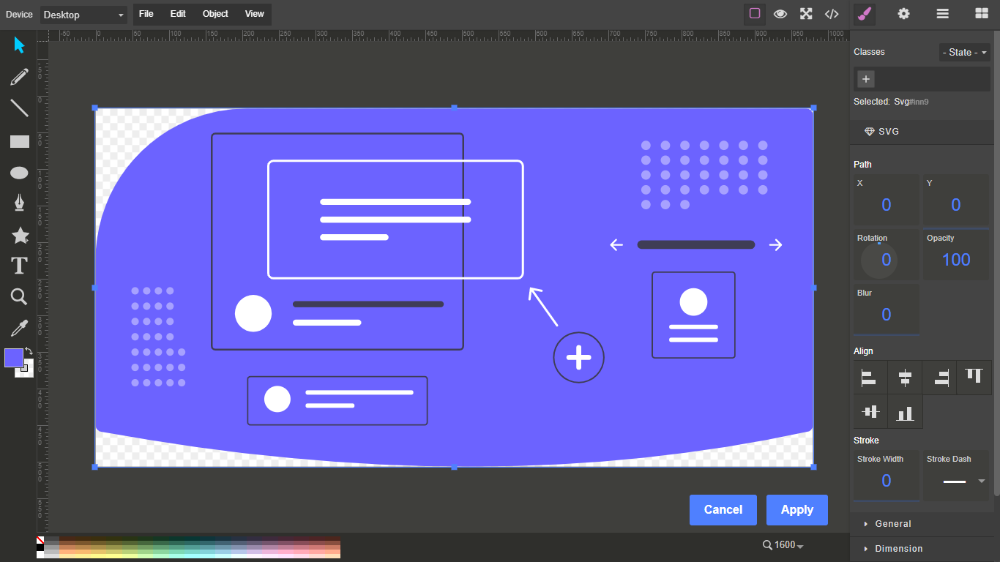

# Grapesjs Svg 

Intergrates the `method draw` SVG editor into `grapesjs`

<div align="center">
  
</div>

>This plugin requires [Method-Draw](https://github.com/methodofaction/Method-Draw), include links to `method-draw.compiled.css`, `jquery.js`  and `method-draw.compiled.js` in the head of your `index.html`. Also include the markup in the `Method-Draw` `index.html` file in your `index.html` file.

You can use this repos `index.html` as a starting point or for reference.

Below is the minimum directories required from `Method-Draw`

#### Dir Structure
```
project
|__css
|  |__font-files
|  |__method-draw.compiled.css
|__extensions
|__images
|__lib
|  |_jgraduate
|  |_jquery.js
|__index.html
|__method-draw.compiled.js
```


### HTML
```html
<link href="https://unpkg.com/grapesjs/dist/css/grapes.min.css" rel="stylesheet">
<script src="https://unpkg.com/grapesjs"></script>
<script src="https://unpkg.com/grapesjs-svg-editor"></script>
<link href="https://unpkg.com/grapesjs/grapesjs-svg-editor.min.css" rel="stylesheet">

<div id="gjs"></div>
```

### JS
```js
const editor = grapesjs.init({
	container: '#gjs',
  height: '100%',
  fromElement: true,
  storageManager: false,
  plugins: ['grapesjs-svg-editor'],
});
```

### CSS
```css
body, html {
  margin: 0;
  height: 100%;
}
```


## Summary

* Plugin name: `grapesjs-svg-editor`
* Blocks
    * `SVG`


## Options

| Option | Description | Default |
|-|-|-
| `svgBlock` | Include SVG block | `{label: 'SVG',category: 'Basic',attributes: {class: 'fa fa-object-group'}}` |
|`extensions`| `SvgEdit` extensions | `{}` |
|`config`| `method` configuration | `{}` |
|`constructor`| `method` constructor | `window.methodDraw` |
|`labelApply`| label for apply button | `Apply` |
|`labelClose`| label for the close button| `Cancel` |
|`commandId`| Id for creating SVG editor command | `mdraw-svg-editor` |
| `toolbarIcon` | Icon used in component toolbar | `<svg>...</svg>` |
| `onApply` | Custom logic when changes are applied | `0` | 


## Download

* CDN
  * `https://unpkg.com/grapesjs-svg-editor`
* NPM
  * `npm i grapesjs-svg-editor`
* GIT
  * `git clone https://github.com/Ju99ernaut/grapesjs-svg-editor.git`


## Usage

Directly in the browser
```html
<link href="https://unpkg.com/grapesjs/dist/css/grapes.min.css" rel="stylesheet"/>
<link href="path/to/grapesjs-svg-editor.min.css" rel="stylesheet"/>
<script src="https://unpkg.com/grapesjs"></script>
<script src="path/to/grapesjs-svg-editor.min.js"></script>

<div id="gjs"></div>

<script type="text/javascript">
  var editor = grapesjs.init({
      container: '#gjs',
      // ...
      plugins: ['grapesjs-svg-editor'],
      pluginsOpts: {
        'grapesjs-svg-editor': { /* options */ }
      }
  });
</script>
```

Modern javascript
```js
import grapesjs from 'grapesjs';
import plugin from 'grapesjs-svg-editor';
import 'grapesjs/dist/css/grapes.min.css';
import 'grapesjs-svg-editor/dist/grapesjs-svg-editor.min.css';

const editor = grapesjs.init({
  container : '#gjs',
  // ...
  plugins: [plugin],
  pluginsOpts: {
    [plugin]: { /* options */ }
  }
  // or
  plugins: [
    editor => plugin(editor, { /* options */ }),
  ],
});
```


## Development

Clone the repository

```sh
$ git clone https://github.com/Ju99ernaut/grapesjs-svg-editor.git
$ cd grapesjs-svg-editor
```

Install dependencies

```sh
$ npm i
```

Start the dev server

```sh
$ npm start
```

Build the source

```sh
$ npm run build
```

## ToDo 

- [x] Button colors(change manually)
- [x] Dropdown colors
- [x] Sidebar and sidebar icons(fixed method-draw in update)
- [x] Color picker theme
- [x] modal theme
- [x] Theme(change manually)


## License

MIT
